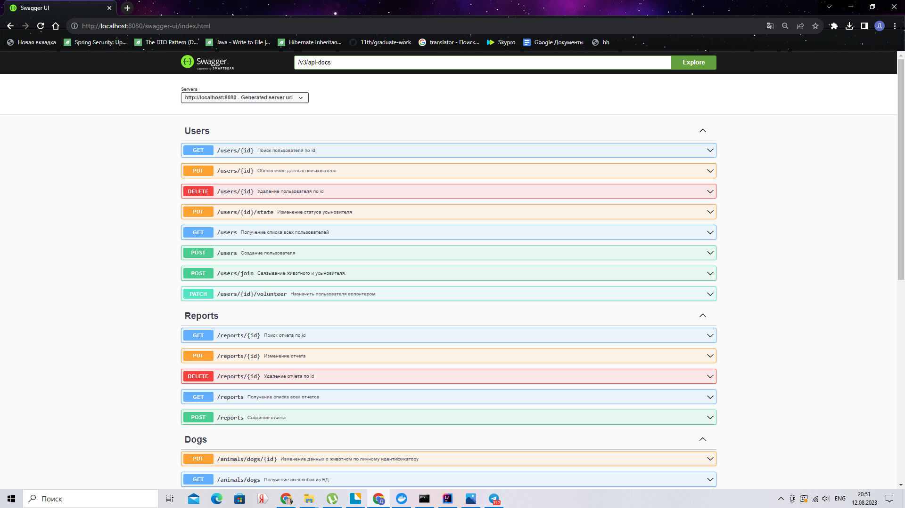

# **Telegram Shelter Bot**


Telegram bot for automation working to animal shelter

[link to project T3](https://skyengpublic.notion.site/4509dd17f5f840f1ba6807fe83aa9c15)

# **Stack:**


# How to run app
- pack jar file by command ```mvn clean install```
- run app by command ```java -Dspring.datasource.username=*** -Dspring.datasource.password=*** -Dspring.telegram.bot.token=*** -jar telegram_team-0.0.1-SNAPSHOT.jar```, *** - username and password, telegrambot token
- for app interface enter http://localhost:8080/swagger-ui/index.html


  
